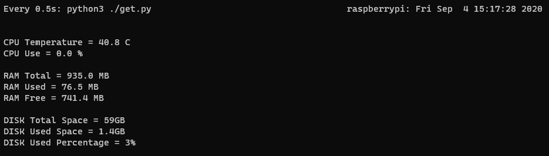

# Real Time rpi Status    
get rpi status every 0.5s.    

# Steps:

- git clone https://github.com/walcer/realtime_rpi_status.git

- cd realtime_rpi_status    

- chmod +x real.sh    

- ./real.sh

# Sample:

# Reference:

https://shumeipai.nxez.com/2014/10/04/get-raspberry-the-current-status-and-data.html?replytocom=46
